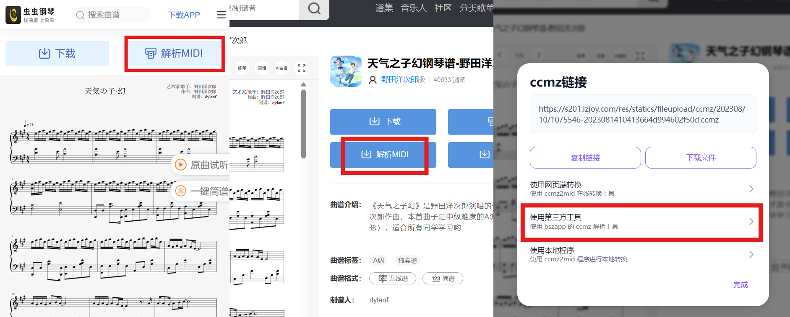
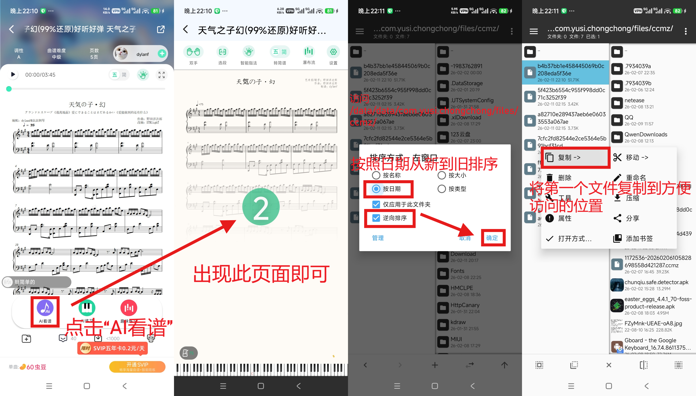

# 如何获取ccmz文件

## 浏览器插件

你需要在浏览器安装Tampermonkey（篡改猴）插件，然后访问下面网址来安装脚本：

https://greasyfork.org/zh-CN/scripts/457019-%E8%99%AB%E8%99%AB%E9%92%A2%E7%90%B4%E9%93%BA%E9%9D%A2%E6%9F%A5%E7%9C%8B%E8%84%9A%E6%9C%AC

点击“解析MIDI”，然后选择本工具即可一键使用。

此方法也适用于部分手机浏览器，例如FireFox（需要下载插件）、Via等。

> 此脚本由 [@TesterNaN](https://github.com/TesterNaN) 提供，除了下载之外还包含一些额外的辅助功能

## 电脑版网页

### 浏览器书签

请直接将下面书签拖动到浏览器的书签栏中：

<ShuqianItem />

在虫虫钢琴曲谱详情页面点击可直接跳转本工具，并附带ccmz文件。

> Tip: 使用Ctrl+Shift+B可显示/隐藏书签栏

### 手动获取

前往[虫虫钢琴官网](https://www.gangqinpu.com/)（电脑版），搜索曲谱并打开；

按下键盘F12（或者右键-检查）打开开发人员工具，切换到`网络`面板（或者是`Network`），然后刷新页面；

在过滤中输入`ccmz`，双击类型为xhr的文件（或者是右键-在新标签页中打开），即可下载。

## 手机App

如果你的Android设备已经root，可以使用官方手机客户端打开曲谱，点击“AI看谱”，然后使用文件管理器（推荐MT管理器）访问`/data/data/com.yusi.chongchong/files/ccmz/`目录，按修改日期从新到旧排序，直接复制出最新的ccmz文件。

如果出现下面情况按钮为灰色说明此曲谱没有对应的ccmz文件，无法导出。请尝试换成同名其他曲谱。

