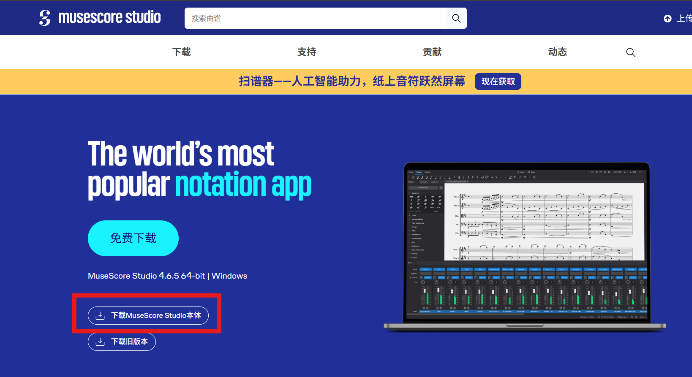
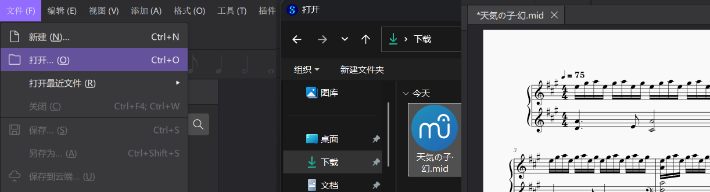
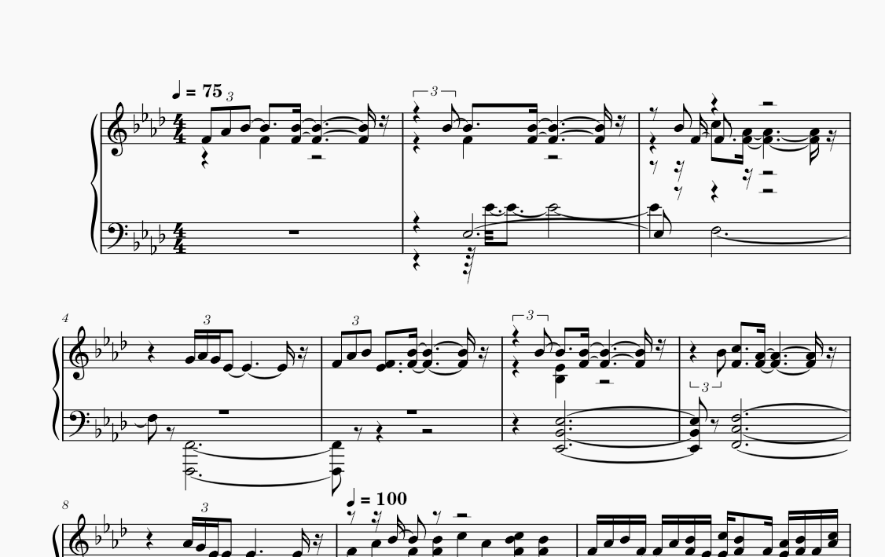
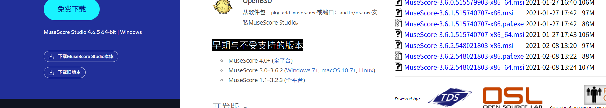
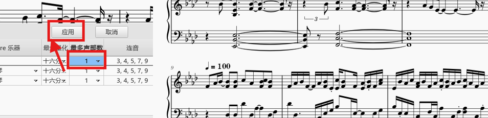

# 如何使用转换后的文件

## MIDI 文件

前往 https://musescore.org/ 下载MuseScore软件本体



打开软件，找到文件-打开，选择下载的mid文件，即可打开



然后，你需要做一些调整，例如：
- 标题、作曲
- 高低音符号
- 音调
- 踏板
- 换行、分页
- ……

### 音符满天飞？

如果出现音符格式错乱（如图），你可以尝试使用MuseScore3来转换，然后使用MuseScore4编辑。



在MuseScore官网找到“下载旧版本”，在新页面找到“早期与不受支持的版本”-“MuseScore 3.0–3.6.2”-“Windows 7+”，下载页面最底部的安装包。然后使用同样的方式打开mid文件。



在底部操作区域将“最多声部数”设为1，然后应用，即可缓解问题。



最后Ctrl+S保存到本地，再使用MuseScore4打开，然后再Ctrl+S保存一次即可。

### 手机也想用？

下载[小小电脑](https://github.com/Cateners/tiny_computer/releases)，下载MuseScore的Appimage（arm64版本），然后升级系统GLIBC版本，解压运行Appimage，然后方法同上。

手机的性能没有电脑好，所以播放的时候声音可能会比较卡，和手机系统、硬件性能有关。

升级GLIBC方法:
```sh
echo "deb http://mirrors.tuna.tsinghua.edu.cn/debian/ sid main contrib non-free non-free-firmware" | sudo tee /etc/apt/sources.list
```
```sh
sudo apt update && sudo apt full-upgrade -y
```
```sh
sudo aptss install libstdc++6 -y
```

验证命令：

```sh
ldd --version
```

其他问题自行研究，不做过多赘述。

## MusicXML 文件

musescore软件同上，直接打开.musicxml文件即可。

然后，你需要做一些调整，不过比midi要少，例如：
- 换行对不对？如果有自动换行的地方插入“将小节保持在同一行”版面标记
- 有没有少什么音符标记？
- 标题是否完整？

### 手机想要直接看？

在各大应用商店搜索“来音制谱”，点击新建-导入本地乐谱，选择musicxml文件即可使用。

## PDF文件

你猜~